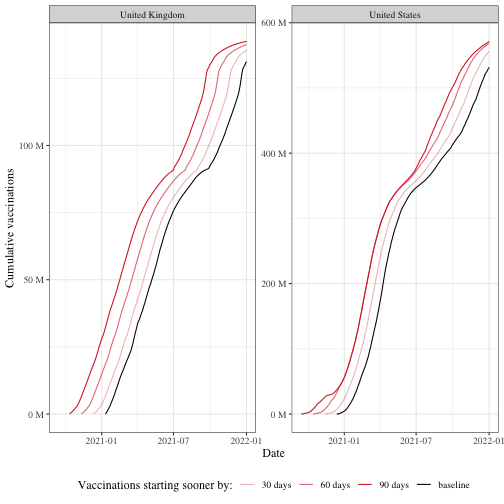
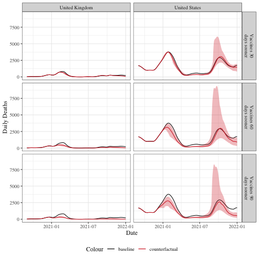
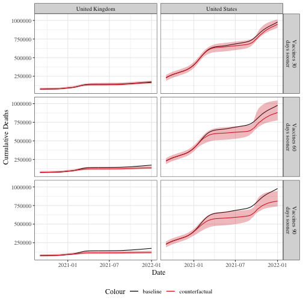
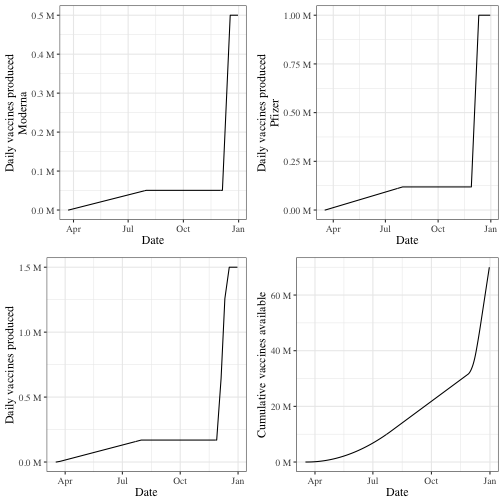
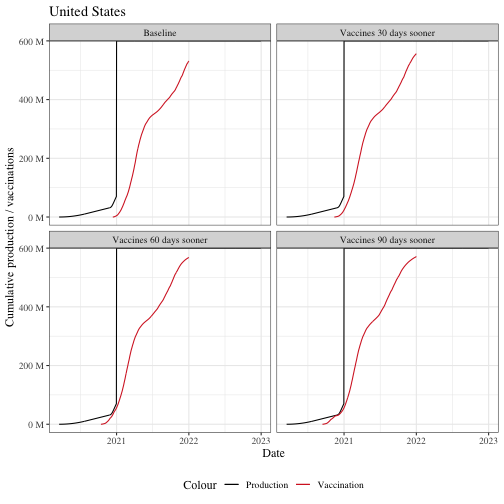

<table>
<caption>Total vaccinations at sample dates</caption>
 <thead>
  <tr>
   <th style="text-align:left;"> shifted_by </th>
   <th style="text-align:left;"> 2021-01-01 </th>
   <th style="text-align:left;"> 2021-04-01 </th>
   <th style="text-align:left;"> 2021-07-01 </th>
  </tr>
 </thead>
<tbody>
  <tr grouplength="4"><td colspan="4" style="border-bottom: 1px solid;"><strong>United Kingdom</strong></td></tr>
<tr>
   <td style="text-align:left;padding-left: 2em;" indentlevel="1"> Baseline </td>
   <td style="text-align:left;"> 0 </td>
   <td style="text-align:left;"> 33,337,926 </td>
   <td style="text-align:left;"> 75,688,766 </td>
  </tr>
  <tr>
   <td style="text-align:left;padding-left: 2em;" indentlevel="1"> Vaccines 30 days sooner </td>
   <td style="text-align:left;"> 3,460,361 </td>
   <td style="text-align:left;"> 42,486,427 </td>
   <td style="text-align:left;"> 80,736,395 </td>
  </tr>
  <tr>
   <td style="text-align:left;padding-left: 2em;" indentlevel="1"> Vaccines 60 days sooner </td>
   <td style="text-align:left;"> 14,859,054 </td>
   <td style="text-align:left;"> 57,449,853 </td>
   <td style="text-align:left;"> 86,771,215 </td>
  </tr>
  <tr>
   <td style="text-align:left;padding-left: 2em;" indentlevel="1"> Vaccines 90 days sooner </td>
   <td style="text-align:left;"> 28,042,344 </td>
   <td style="text-align:left;"> 71,663,088 </td>
   <td style="text-align:left;"> 91,140,069 </td>
  </tr>
  <tr grouplength="4"><td colspan="4" style="border-bottom: 1px solid;"><strong>United States</strong></td></tr>
<tr>
   <td style="text-align:left;padding-left: 2em;" indentlevel="1"> Baseline </td>
   <td style="text-align:left;"> 4,521,988 </td>
   <td style="text-align:left;"> 172,124,225 </td>
   <td style="text-align:left;"> 347,123,032 </td>
  </tr>
  <tr>
   <td style="text-align:left;padding-left: 2em;" indentlevel="1"> Vaccines 30 days sooner </td>
   <td style="text-align:left;"> 23,889,241 </td>
   <td style="text-align:left;"> 238,670,399 </td>
   <td style="text-align:left;"> 357,876,350 </td>
  </tr>
  <tr>
   <td style="text-align:left;padding-left: 2em;" indentlevel="1"> Vaccines 60 days sooner </td>
   <td style="text-align:left;"> 56,107,462 </td>
   <td style="text-align:left;"> 289,245,438 </td>
   <td style="text-align:left;"> 372,702,522 </td>
  </tr>
  <tr>
   <td style="text-align:left;padding-left: 2em;" indentlevel="1"> Vaccines 90 days sooner </td>
   <td style="text-align:left;"> 56,107,489 </td>
   <td style="text-align:left;"> 289,245,510 </td>
   <td style="text-align:left;"> 376,955,754 </td>
  </tr>
</tbody>
</table>

<table>
<caption>DJ5 Averted deaths</caption>
 <thead>
  <tr>
   <th style="text-align:left;"> counterfactual_label </th>
   <th style="text-align:left;"> delta_deaths </th>
   <th style="text-align:left;"> delta_deaths_perpop </th>
  </tr>
 </thead>
<tbody>
  <tr grouplength="3"><td colspan="3" style="border-bottom: 1px solid;"><strong>United Kingdom</strong></td></tr>
<tr>
   <td style="text-align:left;padding-left: 2em;" indentlevel="1"> Vaccines 30 days sooner </td>
   <td style="text-align:left;"> -10,305 [-14,396; -8,666] </td>
   <td style="text-align:left;"> -1.54 [-2.15; -1.29] </td>
  </tr>
  <tr>
   <td style="text-align:left;padding-left: 2em;" indentlevel="1"> Vaccines 60 days sooner </td>
   <td style="text-align:left;"> -38,156 [-41,008; -32,914] </td>
   <td style="text-align:left;"> -5.69 [-6.11; -4.91] </td>
  </tr>
  <tr>
   <td style="text-align:left;padding-left: 2em;" indentlevel="1"> Vaccines 90 days sooner </td>
   <td style="text-align:left;"> -56,951 [-59,908; -51,275] </td>
   <td style="text-align:left;"> -8.49 [-8.93; -7.64] </td>
  </tr>
  <tr grouplength="3"><td colspan="3" style="border-bottom: 1px solid;"><strong>United States</strong></td></tr>
<tr>
   <td style="text-align:left;padding-left: 2em;" indentlevel="1"> Vaccines 30 days sooner </td>
   <td style="text-align:left;"> -28,860 [-104,111; 60,887] </td>
   <td style="text-align:left;"> -0.87 [-3.14; 1.84] </td>
  </tr>
  <tr>
   <td style="text-align:left;padding-left: 2em;" indentlevel="1"> Vaccines 60 days sooner </td>
   <td style="text-align:left;"> -99,184 [-228,676; 89,877] </td>
   <td style="text-align:left;"> -2.99 [-6.90; 2.71] </td>
  </tr>
  <tr>
   <td style="text-align:left;padding-left: 2em;" indentlevel="1"> Vaccines 90 days sooner </td>
   <td style="text-align:left;"> -160,520 [-270,152; -19,130] </td>
   <td style="text-align:left;"> -4.84 [-8.15; -0.58] </td>
  </tr>
</tbody>
</table>

